# css揭秘笔记

## 编码技巧

### 尽量减少代码重复

应减少改动时要编辑的地方以增强代码可维护性。

当某些值相互依赖时，应把它们的的相互关系用代码表达出来，例：

```css
#button {
    background:blue;
    border-radius: 4px;
    box-shadow: 0 1px 5px gray;
    color: white;
    font-size: 20px;
    line-height: 30px;
}
```

这里设置的是一个按钮的css样式，如果我们要重新设置该按钮的大小，相应的行高也应该根据实际情况相应调整，行高与文字大小产生依赖，所以应调整为：

```css
line-height: 1.5;
font-size: 20px;
```

行高始终是字号的1.5倍。

既然已经设置了行高与字体大小的依赖，不妨同时将字体也设置为相对大小，将其始终与父级字体相对，此处就可以使用百分比或`em`设置字号。

```css
font-size: 125%;
/*em作为单位
font-size: 1.25em;
*/
```

上述是在假设父级字体为默认16px大小情况下设置的。

既然已经将文字设置了相对大小，那么按钮的其他部分也应设置相对大小，否则修改文字大小时，其他部分不变会很不协调：

```css
#button {
    background:blue;
    border-radius: .25rem;
    box-shadow: 0 .0625rem .3125rem gray;
    color: white;
    font-size: 1.25rem;
    line-height: 1.5;
}
```

这里使用的是`rem`作为大小单位，它表示的是相对根字体的大小，一般默认为16px，如果要重新设置，只需修改`<html>`元素的字体大小。

### 合理利用简写

```css
background: rebeccapurple;
background-color: rebeccapurple;
```

以上两行代码，第一种是简写式方法，第二种是展开式写法。

当我们在明确要去覆盖某个具体的展开式属性并保留其他相关性样式时就需要用到展开式写法了。

```css
  background:
    url(1.png) no-repeat top right / 2em 2em,
    url(2.png) no-repeat top left / 2em 2em,
    url(3.png) no-repeat bottom right / 2em 2em;
```

以上代码在背景中设置了三张图片，如果要修改图片尺寸是十分不便的，因而此处用展开式写法能方便后期修改：

```css
background:
  url(1.png) top right,
  url(2.png) top left,
  url(3.png) bottom right;
background-size: 2em 2em;
background-repeat: no-repeat;
```

### 关于响应式布局的建议

响应式布局设计（RWD）比较常见的实践使用多种分辨率来测试一个网站，然后设置越来越多的媒体查询（Media Query），但是每个媒体查询都会增加成本（即“注意减少代码重复原则”）。

减少不必要媒体查询的建议：

* 使用百分比或者与窗口相关的单位（vw、vh、vmin和vmax），它们的值要与窗口大小相关。

* 需要在较大分辨率下得到固定宽度时，使用`max-width`而不是`width`，它能使用小的分辨率。

* 要为可替换元素（`img`,`iframe`等）设置一个`max-width`，值为100。

* 使用`background-size: cover`属性使整个背景图片铺满容器，而避免用高分辨率的图片。

* 当元素以行列式进行布局时，让窗口的宽度来决定列的数量。弹性盒布局或者`display: inline-block`加上常见的文本折行可以实现。

* 在使用多列文本时，指定`column-width`(列宽),而不是指定列数，这样它能在较小屏幕自动显示为单列布局。
  
## 背景与边框

### 半透明边框

如果用`hsla`为`<div></div>`设置一个半透明的边框，相关css设置（此处设置的是一个红色的`div`，`hsla`设置的是一个灰色的半透明色）：

```css
.box1{
  width: 6.25rem;
  height:6.25rem;

  background: red;
  border:10px solid hsla(0,0%,100%,.5);
}
```

如果恰好`<html\>`的背景颜色也是默认的白色，你会发现此处设置的`<div>`并没有显示出灰色的半透明边框，而是一个偏红色的边框。

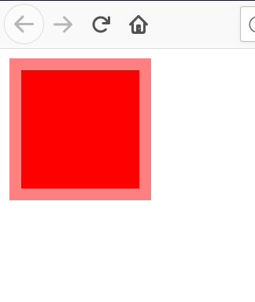

这是因为在默认情况下背景会显示在边框的下层，而边框只是覆盖在了背景上而已，此时只需在原有的背景设置上多增加一个属性`background-clip: padding-box;`，使背景不显示边框区域的内容：

```css
.box1{
  width: 6.25rem;
  height:6.25rem;

  background: red;
  border:10px solid hsla(0,0%,100%,.5);
  
  background-clip: padding-box;
}
```

然而这时得到的边框却又没有了：

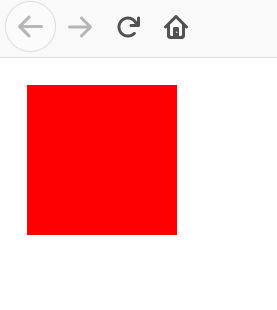

其实并不是没有，只是边框的色调比较低，再加上边框设置的透明度比较低，所以看不见而已，换一个比较深的颜色就能看见了，如：

```css
.box1{
  width: 6.25rem;
  height:6.25rem;

  background: red;
  border:10px solid hsla(240,80%,80%,.5);
  background-clip: padding-box;
  -webkit-background-clip: padding-box;
}
```


### 多重边框

#### box-shadow方案

`box-shadow`支持第四个参数（称作“扩张半径”），通过指定正值或负值来使投影面积增大或减小。一个正值的扩张半径加上两个为零的扩张偏移量以及为零的模糊值，得到的投影就像是一道实线的边框，来模拟出边框。

```css
.box2{
  width: 6.25rem;
  height: 6.25rem;
  background-color: aqua;
  box-shadow: 0 0 0 .625rem #ccc;
}
```

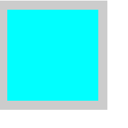

最重要的是`box-shadow`支持逗号分隔法，通过设定多个参数就能得到多重边框。

```css
.box3{
  margin: 10.25rem;
  width: 6.25rem;
  height: 6.25rem;
  background-color: aqua;
  box-shadow: 0 0 0 .625rem royalblue,
              0 0 0 1.25rem red,
              0 0 0 1.625rem palegreen;
}
```

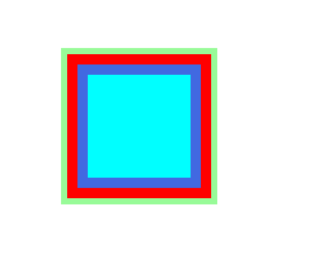

需要注意的一点是，`box-shadow`生成的边框是层层叠加的，所以第一个边框的扩张半径要小于第二个边框的扩张半径，否则第二个边框会覆盖第一个边框。

#### outline方案

在某些情况下只需要两层边框，并且不仅仅希望使用实线边框，希望使用更多丰富样式的边框，这时就可以先使用常规边框，然后再加一层`outline`生成的边框。

```css
.box4{
  margin: 10rem;
  width: 6.25rem;
  height: 6.25rem;
  background-color: aqua;
  border: .625rem solid greenyellow;
  outline: .625rem solid green;
}
```

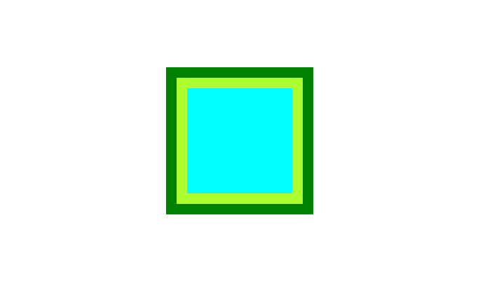

`outline`不仅支持`solid`样式，也支持其它诸如`dashed`之类的样式。

描边的另外好处是可以用`outline-offset`属性来控制它与元素边缘的距离，甚至可以是负值。

```css
.box5{
  width: 6.25rem;
  height: 6.25rem;
  background-color: black;
  outline: .0625rem dashed white;
  outline-offset: -.625rem;
}
```

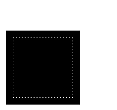

不过需要注意的是`outline`不支持逗号分隔法，因此它是无法像`box-shadow`那样生成多重边框，另外它也没有`radius`属性，不能像普通边框`border`那样生成圆角边框。

### 背景定位

#### 难题

有时我们希望图片能和背景之间有一定空隙，而且不仅仅只是针对背景的左上角作为偏移的原点。我们给出以下解决方案。

#### background-position

`background-position`的扩展语法允许我们指定背景图片距离任意角的偏移量，只要我们在偏移量前面指定关键字。举例来说，如果想让背景图片跟右边缘保持20px的偏移量，同时跟底边保持10px的偏移量，可以使用如下方式做到：

```css
.box6{
  width: 300px;
  height: 200px;
  background:url(./img/8.png) no-repeat #58a;
  background-position: right 20px bottom 10px;
}
```

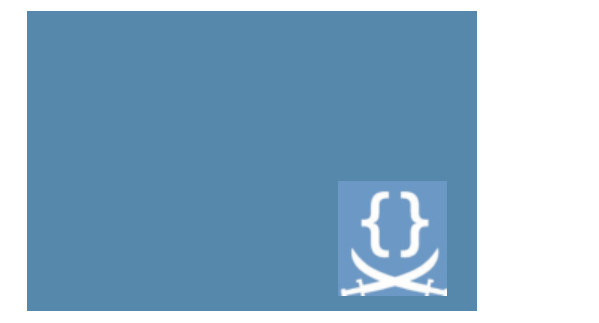

在不支持`background-position`扩展语法的浏览器中，可以把定位值`bottom right`写进`background`的简写属性中。

```css
.box6{
  width: 300px;
  height: 200px;
  background:url(./img/8.png) no-repeat bottom right #58a;
  background-position: right 20px bottom 10px;
}
```

#### background-origin方案

在给背景图片设置距离某个角的偏移量时，如果希望偏移量始终与容器的内边距一致，那么在我们修改内边距的值时，每次都需要在三个地方更新这个值，代码就不够DRY。

在默认情况下，`background-position`是以`padding-box`为基准的，因此`top left`默认指的是`padding box`左上角。`background-origin`属性可以修改这种基准，默认情况下它的值是`padding-box`，如果把它的值改成`content-box`，我们在`background-position`属性中使用的边角将以内容区边缘作为基准。

我们希望偏移量始终与容器内边距保持一致时，就可以把`background-origin`的值赋为`content-box`。

```css
.box7{
  width: 200px;
  height: 200px;
  padding: 10px;
  background: url(./img/8.png) no-repeat #58a top left;
  background-origin: content-box;
}
```


#### calc()方案

把背景图片定位到距离底边10px且距离右边20px的位置，以背景图片左上角偏移的思路来考虑，其实是希望它能有一个100%-20px的水平偏移量，以及100%-10px的垂直偏移量，而`calc()`函数允许我们执行此类运算：

```css
.box8{
  width: 300px;
  height: 200px;
  background: url(./img/8.png) no-repeat #58a;
  background-position: calc(100% - 20px) calc(100% - 10px);
}
```

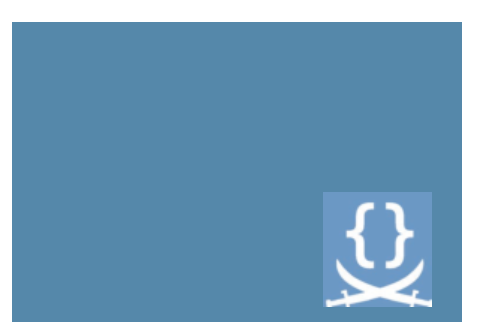

### 边框内圆角

如果我们需要一个容器，它只在内侧有圆角，而在边框或描边的四个角在外部仍然保持直角的形状，可以用两个容器实现：

```html
<div class="box9">
  <div>
    hello World!
  </div>
</div>
```

```css
.box9{
  width: 12.5rem;
  margin: 1.25rem;
  background-color: #655;
  padding: .8em;
}
.box9>div{
  background: tan;
  border-radius: .8em;
  padding:1em;
}
```

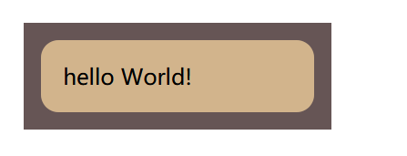

如果只需要一个元素去实现这个效果，下面的解决方案或许有所帮助：

#### 解决方案

```css
.box10{
  width: 12.5em;

  background: tan;
  border-radius: .8em;
  padding: 1em;
  box-shadow: 0 0 0 .6em #665;
  outline: .6em solid #665;
}
```

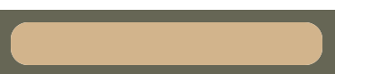

这个的视觉效果首先是通过`border-radius`获得边框的圆角效果，`outline`使图形拥有描边效果，但是描边效果是没有圆角的，此时`border`与`outline`之间存在着空隙：

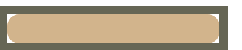

这个空隙就要依靠`box-shadow`来填补，`box-shadow`的颜色与`outline`颜色一致就会融为一体，形成内圆角外直角的视觉效果。

### 条纹背景

现在我们需要条纹的背景，而且不通过加载图片的方式，而是以css的方式形成，现给出以下解决方案：

#### 解决方案

通过线性渐变可以很好地得到条纹背景效果：

```css
.box11{
  margin: 1.25em;
  width: 12.5rem;
  height: 12.5rem;
  background: linear-gradient(#fb3,#58a);
}
```

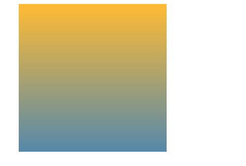

还可以通过百分比的方式来控制两种颜色过渡时占据的空间大小。

```css
.box12{
  margin: 1.25em;
  width: 12.5rem;
  height: 12.5rem;
  background: linear-gradient(yellow 25%, skyblue 75%);
}
```

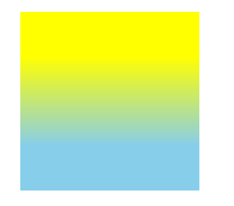

`background: linear-gradient(yellow 25%, skyblue 75%);`，`yellow 25%`意味着从开始到25%的位置是黄色，而`skyblue 75%`则意味着从75%到结束位置是天蓝色，中间从25%到75%则是从黄色过渡到蓝色的空间。

如果使过渡的空间位置为0，即能生成条纹状背景：

```css
.box13{
  margin: 1.25em;
  width: 12.5rem;
  height: 12.5rem;
  background: linear-gradient(yellow 50%, skyblue 50%);
}
```

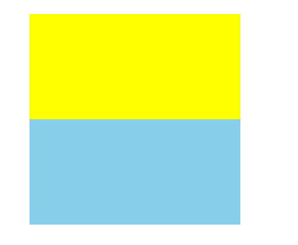

我们可以通过`background-size`来控制背景条纹的大小，`background-size`为两个值时，第一个值用于指定背景图片宽度，第二个值用于指定背景图片高度：

```css
.box14{
  margin: 1.25em;
  width: 12.5rem;
  height: 12.5rem;
  background: linear-gradient(yellow 50%, skyblue 50%);
  background-size: 100% 30px;
}
```

由于背景默认是重复的，所以背景会被多条条纹填充完：

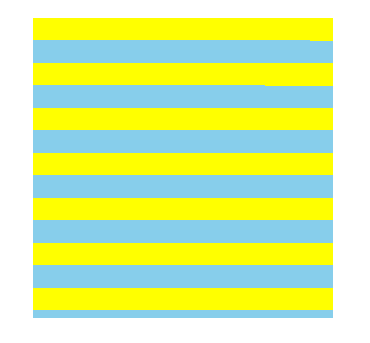

我们如果想要得到不等宽的条纹，只需修改颜色的起始位置或者结束位置。

```css
.box15{
  margin: 1.25em;
  width: 12.5rem;
  height: 12.5rem;
  background: linear-gradient(yellow 25%, skyblue 25%);
  background-size: 100% 30px;
}
```

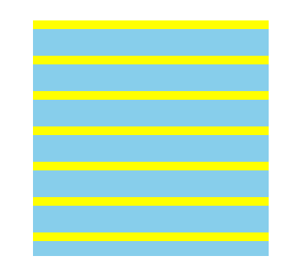

如果后一个颜色的位置值设置的要比前一个颜色的位置值要小，那么它始终将以前一个颜色结束的位置作为起始位置。

```css
.box16{
  margin: 1.25em;
  width: 12.5rem;
  height: 12.5rem;
  background: linear-gradient(yellow 20%, skyblue 0);
  background-size: 100% 30px;
}
```

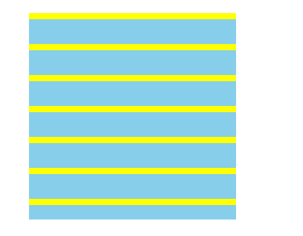

在`linear-gradient`中善用后一颜色位置值为0可以得到多条条纹。

```css
.box17{
  margin: 1.25em;
  width: 12.5rem;
  height: 12.5rem;
  background: linear-gradient(yellow 20%,skyblue 0, skyblue 60%,purple 0);
  background-size: 100% 30px;
}
```

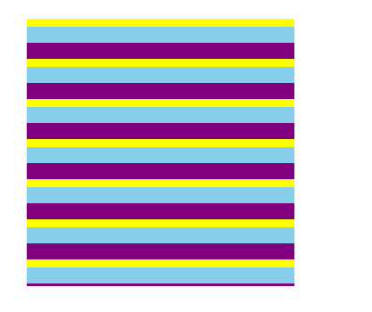

#### 垂直条纹

垂直条纹与水平条纹类似，只需要在线性渐变的参数前添加方向值：

```css
.box18{
  margin: .625rem;
  width: 12.5rem;
  height: 12.5rem;
  background: linear-gradient(to right,yellow 40%,skyblue 0);
  background-size:30px 100%;
}
```

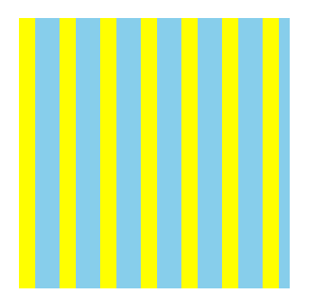

水平条纹是因为线性渐变的方向值默认是`to bottom`，除了`to right`，也可以用`95deg`这样的角度值。

修改了方向值还需要修改`background-size`，这个属性决定背景在宽度与高度上占据的大小。

#### 斜向条纹

如果你以为想要得到45度斜向的条纹,只需要把`linear-gradient`第一个有关方向的参数设定为`45deg`就行了，那么就错了：

```css
.box19{
  margin: .625rem;
  width: 12.5rem;
  height: 12.5rem;
  background: linear-gradient(45deg,yellow 40%,skyblue 0);
  background-size:30px 30px;
}
```

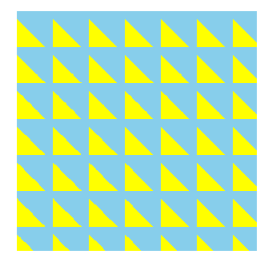

从上图中可以看到生成的背景实际上是重复的三角形拼合而成。

如果想要得到重复的斜向条纹，可以使用`repeating-linear-gradient`设置。

```css
.box20{
  margin: .625rem;
  width: 6.25rem;
  height: 6.25rem;
  background: repeating-linear-gradient(45deg,yellow 0, yellow 15px,skyblue 0,skyblue 30px);
}
```

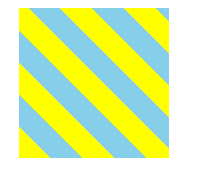

### 复杂背景图案

#### 网格

把水平条纹与垂直条纹叠加起来就能得到各种样式的网格：

```css
.box1{
  width: calc(210px - 15px);
  height: calc(210px - 15px);
  background: white;
  background-image:
    linear-gradient(90deg, rgba(200,0,0,.5) 50% ,transparent 0),
    linear-gradient(rgba(200,0,0,.5) 50%,transparent 0);
  background-size: 30px 30px;
}
```

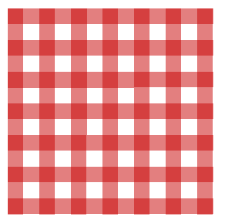

在一些情况下，我们希望每个格子的大小可以调整，而网格线的粗细可以调整：

```css
.box2{
  margin: 20px;
  width: 200px;
  height: 200px;
  background: #58a;
  background-image: 
    linear-gradient(white 1px, transparent 0),
    linear-gradient(90deg, white 1px,transparent 0);
  background-size: 30px 30px;
}
```

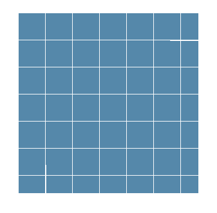

我们甚至可以把两幅不同线宽、不同颜色的网格叠加起来，得到更加逼真的蓝图网格：

```css
.box3{
  margin: 20px;
  width:200px;
  height: 200px;
  background: #58a;
  background-image: 
    linear-gradient(white 2px, transparent 0),
    linear-gradient(90deg, white 2px,transparent 0),
    linear-gradient(hsla(0,0%,100%,.3) 1px,transparent 0),
    linear-gradient(90deg,hsla(0,0%,100%,.3) 1px,transparent 0);
  background-size: 
    100% 75px ,75px 100%,
    100% 15px, 15px 100%;
}
```

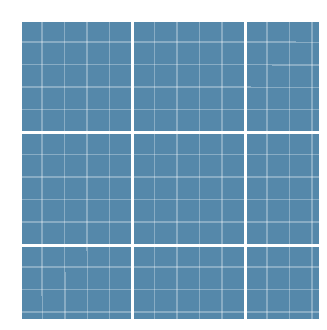
