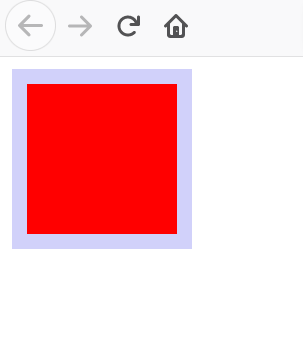

# css揭秘笔记

## 编码技巧

### 尽量减少代码重复

应减少改动时要编辑的地方以增强代码可维护性。

当某些值相互依赖时，应把它们的的相互关系用代码表达出来，例：

```css
#button {
    background:blue;
    border-radius: 4px;
    box-shadow: 0 1px 5px gray;
    color: white;
    font-size: 20px;
    line-height: 30px;
}
```

这里设置的是一个按钮的css样式，如果我们要重新设置该按钮的大小，相应的行高也应该根据实际情况相应调整，行高与文字大小产生依赖，所以应调整为：

```css
line-height: 1.5;
font-size: 20px;
```

行高始终是字号的1.5倍。

既然已经设置了行高与字体大小的依赖，不妨同时将字体也设置为相对大小，将其始终与父级字体相对，此处就可以使用百分比或`em`设置字号。

```css
font-size: 125%;
/*em作为单位
font-size: 1.25em;
*/
```

上述是在假设父级字体为默认16px大小情况下设置的。

既然已经将文字设置了相对大小，那么按钮的其他部分也应设置相对大小，否则修改文字大小时，其他部分不变会很不协调：

```css
#button {
    background:blue;
    border-radius: .25rem;
    box-shadow: 0 .0625rem .3125rem gray;
    color: white;
    font-size: 1.25rem;
    line-height: 1.5;
}
```

这里使用的是`rem`作为大小单位，它表示的是相对根字体的大小，一般默认为16px，如果要重新设置，只需修改`<html>`元素的字体大小。

### 合理利用简写

```css
background: rebeccapurple;
background-color: rebeccapurple;
```

以上两行代码，第一种是简写式方法，第二种是展开式写法。

当我们在明确要去覆盖某个具体的展开式属性并保留其他相关性样式时就需要用到展开式写法了。

```css
  background:
    url(1.png) no-repeat top right / 2em 2em,
    url(2.png) no-repeat top left / 2em 2em,
    url(3.png) no-repeat bottom right / 2em 2em;
```

以上代码在背景中设置了三张图片，如果要修改图片尺寸是十分不便的，因而此处用展开式写法能方便后期修改：

```css
background:
  url(1.png) top right,
  url(2.png) top left,
  url(3.png) bottom right;
background-size: 2em 2em;
background-repeat: no-repeat;
```

### 关于响应式布局的建议

响应式布局设计（RWD）比较常见的实践使用多种分辨率来测试一个网站，然后设置越来越多的媒体查询（Media Query），但是每个媒体查询都会增加成本（即“注意减少代码重复原则”）。

减少不必要媒体查询的建议：

* 使用百分比或者与窗口相关的单位（vw、vh、vmin和vmax），它们的值要与窗口大小相关。

* 需要在较大分辨率下得到固定宽度时，使用`max-width`而不是`width`，它能使用小的分辨率。

* 要为可替换元素（`img`,`iframe`等）设置一个`max-width`，值为100。

* 使用`background-size: cover`属性使整个背景图片铺满容器，而避免用高分辨率的图片。

* 当元素以行列式进行布局时，让窗口的宽度来决定列的数量。弹性盒布局或者`display: inline-block`加上常见的文本折行可以实现。

* 在使用多列文本时，指定`column-width`(列宽),而不是指定列数，这样它能在较小屏幕自动显示为单列布局。
  
## 背景与边框

### 半透明边框

如果用`hsla`为`<div></div>`设置一个半透明的边框，相关css设置（此处设置的是一个红色的`div`，`hsla`设置的是一个灰色的半透明色）：

```css
.box1{
  width: 6.25rem;
  height:6.25rem;

  background: red;
  border:10px solid hsla(0,0%,100%,.5);
}
```

如果恰好`<html\>`的背景颜色也是默认的白色，你会发现此处设置的`<div>`并没有显示出灰色的半透明边框，而是一个偏红色的边框。


这是因为在默认情况下背景会显示在边框的下层，而边框只是覆盖在了背景上而已，此时只需在原有的背景设置上多增加一个属性`background-clip: padding-box;`，使背景不显示边框区域的内容：

```css
.box1{
  width: 6.25rem;
  height:6.25rem;

  background: red;
  border:10px solid hsla(0,0%,100%,.5);
  
  background-clip: padding-box;
}
```

然而这时得到的边框却又没有了：


其实并不是没有，只是边框的色调比较低，再加上边框设置的透明度比较低，所以看不见而已，换一个比较深的颜色就能看见了，如：

```css
.box1{
  width: 6.25rem;
  height:6.25rem;

  background: red;
  border:10px solid hsla(240,80%,80%,.5);
  background-clip: padding-box;
  -webkit-background-clip: padding-box;
}
```



### 多重边框

#### box-shadow方案

`box-shadow`支持第四个参数（称作“扩张半径”），通过指定正值或负值来使投影面积增大或减小。一个正值的扩张半径加上两个为零的扩张偏移量以及为零的模糊值，得到的投影就像是一道实线的边框，来模拟出边框。

```css
.box2{
  width: 6.25rem;
  height: 6.25rem;
  background-color: aqua;
  box-shadow: 0 0 0 .625rem #ccc;
}
```


最重要的是`box-shadow`支持逗号分隔法，通过设定多个参数就能得到多重边框。

```css
.box3{
  margin: 10.25rem;
  width: 6.25rem;
  height: 6.25rem;
  background-color: aqua;
  box-shadow: 0 0 0 .625rem royalblue,
              0 0 0 1.25rem red,
              0 0 0 1.625rem palegreen;
}
```


需要注意的一点是，`box-shadow`生成的边框是层层叠加的，所以第一个边框的扩张半径要小于第二个边框的扩张半径，否则第二个边框会覆盖第一个边框。

#### outline方案

在某些情况下只需要两层边框，并且不仅仅希望使用实线边框，希望使用更多丰富样式的边框，这时就可以先使用常规边框，然后再加一层`outline`生成的边框。

```css
.box4{
  margin: 10rem;
  width: 6.25rem;
  height: 6.25rem;
  background-color: aqua;
  border: .625rem solid greenyellow;
  outline: .625rem solid green;
}
```


`outline`不仅支持`solid`样式，也支持其它诸如`dashed`之类的样式。

描边的另外好处是可以用`outline-offset`属性来控制它与元素边缘的距离，甚至可以是负值。

```css
.box5{
  width: 6.25rem;
  height: 6.25rem;
  background-color: black;
  outline: .0625rem dashed white;
  outline-offset: -.625rem;
}
```


不过需要注意的是`outline`不支持逗号分隔法，因此它是无法像`box-shadow`那样生成多重边框，另外它也没有`radius`属性，不能像普通边框`border`那样生成圆角边框。

### 背景定位

#### 难题

有时我们希望图片能和背景之间有一定空隙，而且不仅仅只是针对背景的右上角作为偏移的原点。我们给出以下解决方案。

#### background-position

`background-position`的扩展语法允许我们指定背景图片距离任意角的偏移量，只要我们在偏移量前面指定关键字。举例来说，如果想让背景图片跟右边缘保持20px的偏移量，同时跟底边保持10px的偏移量，以如下方式做：

```css
.box6{
  width: 300px;
  height: 200px;
  background:url(./img/8.png) no-repeat #58a;
  background-position: right 20px bottom 10px;
}
```

在不支持`background-position`扩展语法的浏览器中，可以把定位值`bottom right`写进`background`的简写属性中。

```css
.box6{
  width: 300px;
  height: 200px;
  background:url(./img/8.png) no-repeat bottom right #58a;
  background-position: right 20px bottom 10px;
}
```

#### background-origin方案

