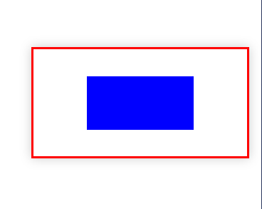

#  定位  
定位常用的有三种类:`relative`、`absolute`、`fixed`
##  位置偏移  
在设置了`position`后，可以使用`left`、`right`、`bottom`、`top`属性设置偏移量。  

`absolute`原本是相对整个页面进行偏移，但如果父元素设置了`position:relative`，该元素相对父元素进行偏移。并且在设置了`absolute`后，如果元素未设置`width`，`height`，则`left,top,right,bottom`都能生效。  

我们通过定位的方式为父元素的子元素相对于父元素进行居中定位。例：  
```less
main{
    width:200px;
    height:100px;
    border:2px red solid;
    box-shadow: 0 0 10px #ccc;
    position:relative;
    left:100px;
    top:100px;
    div{
        
        position: absolute;
        background-color: blue;
        left:25%;
        top:25%;
        right:25%;
        bottom:25%;
    }
}
```


##  粘性定位  
能使元素在移动时具有自动粘附边缘的功能，在给同级设置时移动时会出现叠加的效果。  
注意后出现的元素如果设置了`position`会比之前出现的元素的权重要高。  


