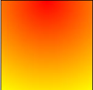

#   表格制作  
##  css定制表格  
通常情况下，我们使用HTML中的`table`,`thead`,`tbody`,`tfooter`,`tr`,`th`,`td`等标签完成一个表格的制作，但是我们也可以用css样式为内容添加样式定制出我们想要的表格出来。为一个简单的块级元素如`section`等添加`display:table-header-group`即可以模拟`thead`，然后为`section`中包裹的`ul`添加`display:table-row`即可模拟`tr`的作用，再为`li`添加`display:table-cell`即可模拟`td`的作用。  
与`table-header-group`类似的还有`table-row-group`、`table-footer-group`。  
我们在为这些块级元素添加上边框属性、内边距属性就能很好地定制出我们想要的表格出来。  

##  表格标题设置  
通常在`table`增加`caption`标签表示表格的标题，可以使用`caption`的属性值`caption-side`控制`caption`出现的位置，默认是`top`，可以设置成`bottom`等。  
我们也可以在普通的用css样式模拟出的表格中，增加一个普通的块级元素标签，只需为它添加`display:table-caption`，即能模拟出`table`中的`caption`来。  


##  单元格间距设置  

`table` 的`border-collapse`被用来设置表格的单元格之间是否有间距，默认值为`separatte`表示分离，可以设置成`border-collapse:collapse`表示不分离单元格。  

`table`的`order-spacing`用来控制单元格之间的间距大小。  

`table`的`empty-cells`用来控制空单元格，如果设置成`empty-cells:hide`则空单元格会被隐藏。  


##  为表格添加背景图像及隔行变色  

隔行变色可以为`tr`添加伪类`nth-of-type()`实现，括号中可以用`odd`表示奇数行，`even`表示偶数行。  

为`table`添加`background:url(图片路径)`可以为整个表格设置背景图片。`background`是简写模式，在简写模式中可以设置位置与背景图片大小，但要以"/"分开。例：  

```html
backgroup:url(img.png) 50% 50%/100px 50px no-repeat;    
```

注意如果要在`background`中添加颜色只能包含在最后一层。  


##  边框渐变效果

边框渐变效果的设置可以使用`background`中的`radial-grandient()`来实现，只需将背景高度设置极短，并控制它出现在元素底部即可实现，括号中可以选填颜色值，各个颜色值以逗号分开，渐变效果默认是以椭圆形状向外辐射，颜色值越先设置，则越靠近重心位置，越往后设置，越远离重心位置。渐变的形状位置是可控的，例如`background:radial-grandient(circle at top,red,yellow),radial-grandient(circle at bottom, yellow,red)`的背景颜色就是以两个圆形向外辐射。  




