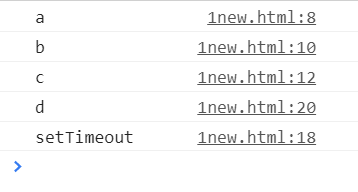
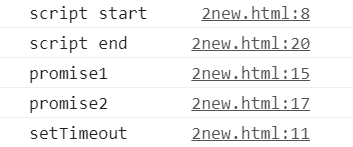
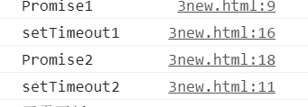

# JavaScript异步机制

## 同步任务与异步任务

如果你看了我有关闭包讲解的文章，应该就会了解到我在闭包那篇文章里讲解`setTimeout()`函数的功能时，有关JavaScript异步机制的简单介绍，现在我将在这篇文章里提纲挈领地介绍JavaScript的异步机制。

JS是单线程的，天生异步，适合IO密集型，不适合CPU密集型。单线程意味着它无法在同一时间去处理多个事情，我们人类是多线程的，我们可以边打字边纠正文字错误，像这种在同一时间只能做一件事情机制被称为“阻塞式”执行，它的所有待处理任务不得不一个一个地排队进行。

JS中的任务可以分为同步任务与异步任务，同步任务比较常见，像是`console.log()`一类就是同步任务，而对于需要改变页面或者渲染页面的任务，比如图片加载、按钮点击事件就是异步任务。主线程在执行任务时会首先将待处理的同步任务按照代码的顺序放入任务执行栈，而当遇到异步任务时，会将异步任务放入任务队列中。当同步任务执行完，任务执行栈也就被清空了，这时候才会将任务队列中的异步任务放入任务执行栈内，按照次序去执行异步任务。

以下代码的执行过程就是先执行同步任务，再执行异步任务的过程：

```js
console.log("a");
function fun1(){
  console.log("b");
  function fun2(){
    console.log("c");
  }
  fun2();
}
fun1();
setTimeout(function(){
  console.log("setTimeout");
}, 1000);
console.log("d");
```



所以当我们给`setTimeout`设置了一个等待的时间，当同步任务还没有结束时，即使`setTimeout`函数的等待时间到了，它依然是不会执行的，它只会在同步任务结束再去计算时间后执行`setTimeout`内的函数。

## 宏任务与微任务

现在运行如下代码：

```js
console.log('script start');

setTimeout(function() {
  console.log('setTimeout');
}, 0);

Promise.resolve().then(function() {
  console.log('promise1');
}).then(function() {
  console.log('promise2');
});

console.log('script end');
```

它的运行结果如下图所示：



你可能会疑惑`Promise.resolve()`是什么，它是同步任务吗？为什么先执行它后执行`setTimeout`，实际上它是异步任务里的微任务，这里就得介绍下宏任务与微任务了。

异步任务还可分为宏任务与微任务，并且它们也有着不同的任务队列，它们的执行顺序是先执行宏任务队列中的一个宏任务，再去清空微任务队列，再去根据代码顺序执行宏任务队列中的下一个任务，如果中间遇到新的微任务，会把它放进微任务队列，待这个宏任务被执行完，再去清空一遍微任务，一直不停地重复上述步骤，直到所有任务被执行完（这里只说浏览器中的执行顺序，如果是node运行时的环境还会有所不同。

> 除了上述的`Promise.resolve()`外，微任务还有：原生`Promise`(有些实现的`promise`将`then`方法放到了宏任务中)、`process`.`nextTick`、`Object.observe`(已废弃)、 `MutationObserver`记住就行了。
>
> 宏任务有包括整体代码`script`，`setTimeout`，`setInterval`、`setImmediate`。

整体代码就是一个宏任务，所以上述代码在`setTimeout()`之前已经执行过一次宏任务了，因此才会先输出`Promise.resolve()`的代码，后执行`setTimeout`。

### 案例

现在我们再通过如下代码来再次感受下宏任务、微任务的处理过程：

```html
<!DOCTYPE html>
<html lang="en">
<head>
  <meta charset="UTF-8">
  <title>Document</title>
  <script>
    Promise.resolve().then(()=>{
    console.log('Promise1');
    setTimeout(()=>{
    console.log('setTimeout2')
    },0)
    })

    setTimeout(()=>{
      console.log('setTimeout1')
      Promise.resolve().then(()=>{
      console.log('Promise2')
    })
    },0)
  </script>
<body>
  
</body>
</html>
```

`script`里面只有`promise`和`setTimeout()`，不存在其它函数，所以找不到同步任务去执行异步任务（是的，想要执行异步任务里面的同步任务就得先执行异步任务）。

`script`总体是一个宏任务，所以先执行了一个宏任务，然后寻找微任务进行执行，第一层的`Promise.resolve()`与`setTimeout()`显然`promise`是微任务，进入到`then()`里面，遇到`console.log('Promise1')`，它是个同步任务立即执行，然后又遇到`setTimeout(()=>{console.log('setTimeout2')},0)`，这是个宏任务，把他放进宏任务队列。

然后去执行宏任务队列中的第一个任务，也就是:

```js
setTimeout(()=>{
  console.log('setTimeout1');
  Promise.resolve().then(()=>{
  console.log('Promise2')
  })
},0)
```

进入到该函数里面，遇到`console.log('setTimeout1');`，立即执行，然后又遇到`Promise.resolve().then(()=>{console.log('Promise2')})`，把他放进微任务队列。执行完宏任务后，再去清空微任务队列。因此输出结果是：



## Event Loop

像上述那样不断地把任务（包括先执行同步任务后执行异步任务）放进主线程去执行的过程称为事件循环（Event Loop）