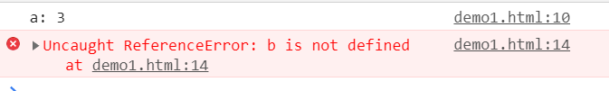

# JavaScript闭包

闭包是JavaScript中的重要内容，官方的定义为：函数和对其周围状态（lexical environment，词法环境）的引用捆绑在一起构成闭包（closure）。也就是说，闭包可以让你从内部函数访问外部函数作用域。在 JavaScript 中，每当函数被创建，就会在函数生成时生成闭包，块级作用域也会生成闭包。

如上所述，闭包是与作用域息息相关的，为了理解闭包的概念，首先我们需要了解JavaScript的作用域概念。

## 作用域

作用域大致可以分为两类，一类是动态作用域，一类是词法作用域，JavaScript所采用的是词法作用域。

与大多数语言相同的是，JavaScript的作用域分为全局作用域和局部作用域，局部作用域分为块级作用域与函数作用域，在ES6之前，实际上块级作用域是不存在的。

所谓全局作用域，一般是定义的最外层函数外的变量和最外层函数，不一般的情况下，包括未声明就直接使用的变量自动提升为全局作用域的变量，以及对象`window`的属性（但实际情况是，最外层函数以及最外层函数外的变量都是该`window`对象的属性）。

函数作用域则顾名思义是函数内部声明的变量和函数内部的定义的方法。

让我们看一组例子：

```javascript
var a=3;
function foo(){
  console.log("a: "+a);
  var b=2;
}
foo();
console.log("b: "+b);
```

以下是它的运行结果：



如上所示，运行结果显示了一个`error`，这个错误是典型`ReferenceError`，造成它的原因是因为在`console.log("b: "+b);`时，并没有查找到变量`b`，而`console.log("a: "+a);`却能正常运行。造成上述错误的原因在于在函数`foo()`内部定义的变量`b`的作用域是函数作用域，这意味着这个函数只能在`foo()`内部被使用。而变量`a`是在函数外部定义的，它的作用域是全局作用域，这意味着虽然在该函数作用域内无法查找到该函数，但可以去函数的作用域外进行查找。

### 作用域遮蔽

现在我们知道了，在函数作用域内声明的变量仅拥有该函数的作用域，在函数外部无法访问该函数，那么如果在函数内部重新声明一个与函数外声明的相同变量，并且同时在函数体内和函数体外打印该变量，这个变量的值会是怎样？

```js
var a=3;
function foo(){
  var a=5;
  console.log(a);
}
foo();
console.log(a);
```


答案是，函数体内声明的变量由于处于函数作用域内，它的变量输出就是函数作用域内的值，而函数体外的变量输出则与函数体的新声明的相同名字变量无关，依然是全局作用域下的该变量的值。

现在再看一个例子

```js
var a=2;
function foo(){
  a=5;
}
foo();
console.log(a);
```

以上代码与前一个的区别在于，`a`这个变量在`foo()`内没有声明，因此它的作用域就是全局作用域，那么函数体内对它进行改变是真的修改了全局作用域中该变量的值，那么`console.log(a);`的输出为5。

现在我们再来观察另一种写法：

```js
var a = 5;
function fun1(a){
  a=7;
  console.log(a);
}
fun1(a);
console.log(a);
```

它的运行结果又会与之前的写法不同：


原因在于这里全局作用域下的`a`会被作为参数的值传递给函数作用域内的`a`，`fun1(a)`中的`a`是属于函数作用域的，即使把它修改成别的变量名也是可以的，并不会影响全局作用域内的`a`，相同于在函数作用域内重新声明了一个名为`a`的变量。

## 闭包

现在我们已经基本了解了全局作用域，我们可以把全局作用域看成只是比函数作用域大一点的作用域，因为全局作用域类内变量和函数依然是在`window`对象的内部。

我们现在来看下面的代码：

```js
function foo(){
  function fun1(){
    console.log("fun1");
  }
}
```

我们能否在`foo()`函数外使用`fun1()`函数？答案是否定的，`fun1()`所在的作用域是`foo()`函数内部，按照作用域的规则我们只能在`foo()`函数内部使用这个函数，函数作用域也可以看成是一个封闭的空间，但并不意味着我们真的无法在函数外部使用内部函数了。

```js
function foo(){
  function fun1(){
    console.log("fun1");
  }
  return fun1;
}
var b=foo();
b();
```

这里实际上就使用了闭包，函数`fun1`作为返回值返回给了变量`b`，那么`b`就成为了函数可以输出`fun1()`作用域内的`console.log("fun1");`。像这样的，在函数外部能访问到函数作用域内定义的变量或者函数，就叫做闭包。

JavaScript具有自动回收机制，由于闭包的存在使得函数的作用域能始终存在，不会被垃圾回收机制回收掉。

### setTimeout与for循环的经典案例

现在来观察如下代码：

```js
for(var i=0;i<5;i++){
  setTimeout(function timer(){
    console.log(i);
  }, 1000);
}
```

`setTimeout`是一个异步函数，在执行完所有同步函数后，异步函数才会被执行，`setTimeout`一般只需要用上两个参数，一个是要执行的函数，另一个是要等待的时间，默认单位是毫秒，这里不谈论异步、同步的知识点。

可能我们会以为上述的输出应该是每次等待1000ms（这里的时间是不精确的）后，依次输出0，1，2，3，4，然而真正的输出结果如下图所示：


实际上输出的是5个5！而且只会等待1000ms后将这五个5几乎同时输出，这个时间的问题涉及到`setTimeout`异步原理，这里简单介绍下，`setTimeout`是异步函数，每次执行到它时，它会把它内部设置的函数暂存到任务队列中。给它设置一个时间，等到时间到了，并且同步函数已经被执行完了才能执行暂存到任务队列的函数，但是如果同步函数没有执行完，尽管设置的时间到了，它依然需要等待同步函数执行完才能执行任务队列中的函数。

输出5个5的原因是因为`var i`使得`i`处于全局作用域下，由于`setTimeout`是异步函数，它会等待所有同步函数先执行完再去执行它内部设置的输出函数，`for`循环属于同步的内容，每次循环执行到`setTimeout`都会将它内部的`timer`函数放到任务队列中，等到同步函数结束后，再去执行任务队列中的`timer`函数，由于`i`是全局变量，它不受`timer()`函数作用域影响，输出的自然是全局作用域的`i`。

> 详细解释下：
> 首先执行for循环，执行到`setTimeout`函数时，需要将`setTimeout`函数内部设置的函数存放到任务队列中，这个时候i是0,
> 然后按照刚刚那样重复4次，
> for循环结束后，由于异步机制，需要把任务队列中的函数在`setTimeout`设置的时间后执行，那么就相当于执行`console.log(i)`,这个时候i等于5，所以输出5个5。

要解决上述问题，只需要在每次执行到`setTimeout`函数时，都能将变化的`i`捕获一次，作为`timer`函数的参数存放到任务队列中。这里考虑下述两种方式。

### 利用函数作用域

```js
for(var i=0;i<5;i++){
  function foo(i){
    var j=i;
    setTimeout(function timer(){
      console.log(j);
    }, 1000);
  }
  foo(i)
}
```

上述代码多设置了一个`foo`函数，在`foo`函数内部设置了一个变量`j`，因而这个`j`拥有函数作用域，`j`捕获每次发生变化的`i`，这样任务队列中的`timer()`函数输出的自然是函数作用域中的`j`，`j`变量随着每次循环而变化，任务队列的`timer()`“保存”好每次变化的`j`，而不像输出全局变量`i`时那样“偷懒”，仅仅查找一次全局状态下的`i`。

### 块级作用域与let

`let`声明变量是ES6新增的内容，它与`for`循环配合能形成块级作用域。

```js
for(var i=0;i<5;i++){
  let j=i;
  setTimeout(function timer(){
    console.log(j);
  }, 1000);
}
```

这个思路其实与利用函数作用域捕获变化的`i`作为局部变量的思路是类似的。`let`声明的变量具有块级作用域，`for`循环的花括号内容就是一个“块”，每次循环时，`let`声明的`j`都是不同的`j`，而`timer()`就要重新“确认”一遍`j`，等待任务队列中函数被输出进行查找引用。

> 详细解释下局部变量的不同
> 首先执行for循环，执行到`setTimeout`函数时，需要将`setTimeout`函数内部设置的函数存放到任务队列中，这个时候存放的是局部变量,
> 然后按照刚刚那样重复4次，
> for循环结束后，由于异步机制，需要把任务队列中的函数在`setTimeout`设置的时间后进行执行，由于无论函数作用域或者块级作用域都是块级作用域，再加上闭包的机制——它们被声明时的作用域依然可以被引用，所以可以说任务队列中存放的5个`timer`中的`console.log(j)`分别对每次重新声明时的j进行了查找引用。

而`var`在函数外声明的变量不拥有块级作用域，每次`for`循环看似在“刷新”，然而它终究还是那个拥有全局作用域的它。